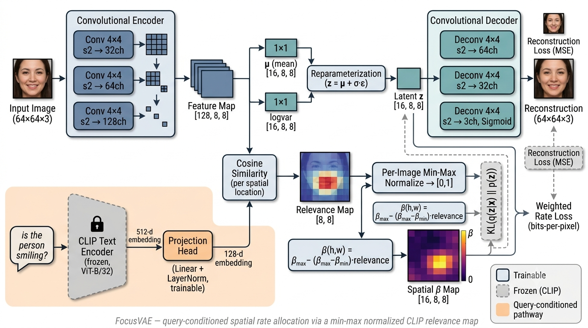

<div align="center">

# FocusVAE
### Query-Adaptive Semantic Image Compression

*A convolutional VAE whose per-region bit allocation is conditioned on a natural-language query.*

[](https://www.python.org/)
[](https://pytorch.org/)
[](https://developer.apple.com/metal/pytorch/)
[](https://huggingface.co/openai/clip-vit-base-patch32)
[](LICENSE)

[Idea](#the-idea) · [Architecture](#architecture) · [Results](#results) · [Debugging Journal](#debugging-journal--two-real-bugs-and-what-they-taught-me) · [Setup](#setup) · [Usage](#usage)

</div>

---

## The idea

Standard image compression — JPEG, and standard VAEs alike — spends bits **uniformly** across every pixel. But in most real deployments, not every pixel matters equally: a security camera asking *"is there a person in frame?"* doesn't need the sky reconstructed at full fidelity, and a driver-monitoring system asking *"are the driver's eyes open?"* doesn't need the dashboard reconstructed perfectly.

**FocusVAE** conditions the rate-distortion tradeoff of a VAE on a natural-language query. A frozen CLIP text encoder locates *where in the image the query cares about*, and the model spends more of its latent bit budget there — while compressing everything else harder, for the same total cost.

> *"Is the person smiling?"* → bits concentrate on the mouth.
> *"Is the person wearing glasses?"* → bits concentrate on the eyes.
> Same total bit budget. Different, query-dependent allocation.

This project runs alongside my M.Tech thesis (**FocusVLM** — query-adaptive visual token pruning for efficient VLM inference). Both explore the same underlying question — *should a model's compute/bit budget be static, or should the query decide where it goes?* — applied to two different problems: token pruning for inference, and rate allocation for compression.

### Why this matters in practice
Bandwidth- and storage-constrained vision pipelines — edge cameras, satellite triage, IoT sensors — usually care about *task-relevant* content, not uniform pixel fidelity. A trainable, query-conditioned knob for that tradeoff is directly useful in exactly these settings.

---

## Architecture

<div align="center">

<!--
  PLACE THE GENERATED ARCHITECTURE DIAGRAM HERE, e.g.:
  

  See "Architecture diagram - generation prompt" below for the exact prompt
  used to generate this figure. Save the image to assets/focusvae_architecture.png
  and uncomment the line above once it's ready.
-->

*(architecture diagram goes here — see generation prompt below)*

</div>

**In one paragraph:** an input image passes through a fully-convolutional encoder that produces a *spatial* latent grid (8×8 locations, not one flattened vector). In parallel, the query text is embedded by a frozen CLIP text encoder and projected into the same channel space as the encoder's feature map. Cosine similarity between the projected query embedding and every spatial location of the feature map produces a relevance map, which is min-max normalized per image. That relevance map is turned into a spatially-varying β (low β where relevant → weak KL penalty → more information kept; high β elsewhere → strong penalty → aggressive compression), which weights the KL term of the ELBO independently at every latent location before the (reparameterized) latent grid is decoded back into a reconstruction.

### Architecture diagram — generation prompt

Use the following prompt with an image generation tool to produce `assets/focusvae_architecture.png`:

> Create a clean, professional, technical machine-learning architecture diagram in a modern flat vector style, suitable for a GitHub README and a research paper figure. White background, minimal drop shadows, rounded rectangles for modules, thin arrows for data flow, a restrained color palette (slate blue, teal, soft orange for the "query" pathway, gray for frozen/non-trainable components). Landscape orientation, roughly 1600×900px.
>
> Layout, left to right, two parallel input branches merging into a shared pipeline:
>
> **Top-left branch (image pathway):** A small icon of a 64×64 face photo labeled "Input Image (64×64×3)" feeds into a box labeled "Convolutional Encoder" containing three smaller stacked sub-blocks labeled "Conv 4×4 s2 → 32ch", "Conv 4×4 s2 → 64ch", "Conv 4×4 s2 → 128ch" (each downsampling, shown with a shrinking grid icon 64→32→16→8). This outputs into a labeled tensor block "Feature Map [128, 8, 8]".
>
> **Bottom-left branch (query pathway, colored soft orange to visually separate it):** A speech-bubble icon containing the example text "is the person smiling?" feeds into a box labeled "CLIP Text Encoder (frozen, ViT-B/32)" — draw this box with a lock icon and a gray/dashed border to indicate it is frozen and not trained. Its output arrow is labeled "512-d embedding" and feeds into a small trainable box labeled "Projection Head (Linear + LayerNorm, trainable)" outputting "128-d embedding", drawn with a solid colored border to contrast with the frozen CLIP box.
>
> **Fusion point:** Both the "Feature Map [128, 8, 8]" and the "128-d query embedding" feed into a box labeled "Cosine Similarity (per spatial location)" which outputs an 8×8 heatmap icon (a small grid with a red-to-blue color gradient, hotter near where a mouth would be on a face silhouette overlay) labeled "Relevance Map [8, 8]". An arrow from this heatmap goes into a box labeled "Per-Image Min-Max Normalize → [0,1]".
>
> The normalized relevance map then feeds into a box labeled "β(h,w) = β_max − (β_max−β_min)·relevance" drawn as a small formula card, producing a "Spatial β Map [16, 8, 8]" tensor icon, shown as an 8×8 grid colored from dark purple (high β / heavy compression) to bright yellow (low β / more bits kept) — make this gradient visually match the same hot region as the relevance heatmap above it, to make the "query points here → more bits here" idea visually obvious at a glance.
>
> **Latent branch:** The original "Feature Map [128, 8, 8]" also feeds separately into two parallel small boxes labeled "μ (mean) [16, 8, 8]" and "logvar [16, 8, 8]" (1×1 convolutions), which combine via a "Reparameterization (z = μ + σ·ε)" box into "Latent z [16, 8, 8]".
>
> **KL term:** Draw a dashed box off to the side labeled "KL(q(z|x) ‖ p(z))" receiving arrows from both μ/logvar and from the "Spatial β Map", merging into a small labeled output "Weighted Rate Loss (bits-per-pixel)" — visually distinct (dashed border, slightly desaturated) to indicate this is a loss-computation path, not a forward-inference path.
>
> **Decoder branch:** "Latent z [16, 8, 8]" flows into a box labeled "Convolutional Decoder" with three stacked sub-blocks mirroring the encoder ("Deconv 4×4 s2 → 64ch", "Deconv 4×4 s2 → 32ch", "Deconv 4×4 s2 → 3ch, Sigmoid") with a growing grid icon 8→16→32→64, finally outputting a reconstructed 64×64 face icon labeled "Reconstruction (64×64×3)" next to a small "Reconstruction Loss (MSE)" tag comparing it back to the original input image icon with a dashed comparison arrow.
>
> Add a small legend box in the bottom-right corner with three swatches: a solid-border box labeled "Trainable", a gray dashed-border box labeled "Frozen (CLIP)", and an orange-tinted region labeled "Query-conditioned pathway". Add a subtle caption beneath the whole diagram in a light gray small font: "FocusVAE — query-conditioned spatial rate allocation via a min-max normalized CLIP relevance map".
>
> Overall aesthetic: think of a polished figure from a deep learning systems paper (in the visual style of diagrams from Papers With Code or a NeurIPS architecture figure) — precise, uncluttered, legible at both full size and as a small README thumbnail.

---

## Results

Evaluated on a held-out CelebA test split, 64×64 resolution, `z_ch=16` over an 8×8 spatial grid.

| Model | Overall PSNR | Overall SSIM | bpp | Region-restricted PSNR |
|---|---|---|---|---|
| VanillaVAE (baseline, uniform β) | 19.16 dB | 0.527 | 0.0402 | 19.05 dB |
| FocusVAE (query-adaptive β) | 18.71 dB | 0.503 | 0.0415 | 18.67 dB |

*(bit budgets matched within ~3%; see [`results/comparison.md`](results/comparison.md), regenerated by `src/evaluate.py`)*

**Honest headline finding:** at a matched bit budget, with the relevance-collapse bug fixed (see below), FocusVAE shows **no measurable region-quality advantage** over the uniform-β baseline in this configuration — overall and region-restricted PSNR are both marginally *lower* than the baseline, not higher.

### Why this is probably happening

The latent grid here is only **8×8** for a 64×64 input — each latent cell corresponds to an 8×8 pixel patch. The landmark-derived query regions (mouth, eyes) are typically only 15–25px wide, meaning the "relevant" area often spans just **2–3 latent cells**. There's very little spatial resolution for a "spend more bits here, not there" mechanism to meaningfully act on at this scale — the model is being asked to make a fine-grained spatial decision on an extremely coarse grid.

### Most promising next step (not yet run)
Remove one downsampling stage from the encoder/decoder (`src/models/backbone.py`) to produce a 16×16 latent grid instead of 8×8 — four times the spatial resolution for the same 64×64 input — and re-run the same matched-budget comparison. If the query-adaptive mechanism is capacity-starved rather than fundamentally ineffective, this should reveal it.

---

## Debugging journal — two real bugs, and what they taught me

Documenting this honestly because the debugging process is arguably the most useful part of this project to show, not the numbers themselves.

### Bug 1 — Posterior collapse from a loss-scale mismatch
`reconstruction_loss` originally averaged MSE over all pixels (`reduction="mean"`) while the KL term summed over all 1024 latent dimensions — putting KL roughly **1000× larger** in scale than reconstruction. The optimizer exploited this immediately: it collapsed every latent to the prior and ignored the input image entirely. Symptom: overall PSNR ≈ 11 dB, and — the real tell — both the baseline and FocusVAE scored *identically* on evaluation, because both had degenerated into predicting a constant, near-average face regardless of input.

**Fix:** sum reconstruction error per sample instead of averaging (`src/losses.py`), matching KL's existing per-sample summation so the two ELBO terms are on comparable scales.

### Bug 2 — Relevance-map collapse (a reward hack)
After fixing Bug 1, both models trained and reconstructed real content. But across four rounds of β-budget tuning, FocusVAE's region-PSNR advantage over the baseline *shrank in lockstep with the bpp gap* — and disappeared entirely once bpp was matched. That pattern was suspicious enough to inspect the relevance map directly:

```
relevance.std() across spatial locations ≈ 1e-4   (essentially constant, ~1.0 everywhere)
```

The original formulation, `sigmoid(τ · cosine_similarity)` with a learnable temperature `τ`, let the optimizer discover it could minimize the KL penalty **uniformly** by driving `τ` up and pushing relevance to ≈1.0 across the entire image — completely defeating query conditioning while still passing every sanity check (loss decreasing, no NaNs, reasonable reconstructions). Every earlier "FocusVAE wins" result had actually just been measuring a disguised global β value, not query-adaptive behavior.

**Fix:** replace the sigmoid threshold with **per-image min-max normalization** of the cosine-similarity map. This makes global collapse structurally impossible — every relevance map is forced to span the full [0, 1] range per image, regardless of the raw similarity scale.

### The lesson
A model that trains "successfully" — smoothly decreasing loss, no numerical instability, plausible-looking outputs — does not mean every component is doing what it was designed to do. The query-conditioning mechanism here was silently dead for several full training runs while every other health signal looked fine. The only thing that caught it was directly inspecting an intermediate tensor's variance, not looking at the loss curve or the final metric.

---

## Setup

**Hardware used:** MacBook (Apple Silicon, M-series), 24GB unified memory, MPS backend, no CUDA.

```bash
git clone https://github.com/Sagnik120/FocusVAE.git
cd FocusVAE

python3 -m venv .venv
source .venv/bin/activate
python -m pip install --upgrade pip
pip install -r requirements.txt

# sanity check MPS is available before doing anything else
python -c "import torch; print('MPS available:', torch.backends.mps.is_available())"
```

### Dataset — CelebA via Kaggle
```bash
mkdir -p ~/.kaggle
# place your kaggle.json (username + key) at ~/.kaggle/kaggle.json
chmod 600 ~/.kaggle/kaggle.json

python data/download_celeba.py --out data/celeba --subset 15000
python data/prepare_queries.py --root data/celeba
```
CelebA was chosen over a captioned dataset (e.g. COCO) because its 40 binary attributes give free, natural-language queries via simple templates ("is the person smiling?"), and its 5-point facial landmarks let region-restricted evaluation (mouth/eyes/nose crops) work without any extra annotation effort.

---

## Usage

```bash
# baseline (uniform-β spatial VAE)
caffeinate -i python src/train.py --config configs/vanilla.yaml

# FocusVAE (query-adaptive β; first run downloads CLIP-ViT-B/32, ~600MB)
caffeinate -i python src/train.py --config configs/focus.yaml
```
(`caffeinate -i` prevents macOS from sleeping mid-training on a long run — recommended for anything over a few minutes.)

```bash
# matched-budget comparison: overall + region-restricted PSNR/SSIM/bpp
python src/evaluate.py --vanilla_ckpt checkpoints/vanilla/best.pt \
                        --focus_ckpt checkpoints/focus/best.pt \
                        --data data/celeba
```

```bash
# interactive demo: image + query -> relevance heatmap + both reconstructions
python demo/app.py
```

```bash
# push a trained checkpoint to Hugging Face Hub
huggingface-cli login
python scripts/push_to_hub.py --repo Sagnik120/focus-vae --ckpt checkpoints/focus/best.pt
```

---

## Repo layout
```
FocusVAE/
├── assets/                       # architecture diagram lives here
├── data/
│   ├── download_celeba.py        # Kaggle download + subsetting
│   └── prepare_queries.py        # attribute -> query templates, landmark region boxes
├── src/
│   ├── dataset.py                 # CelebA Dataset with (image, query, region-box) triples
│   ├── losses.py                   # reconstruction + per-location weighted KL, bpp estimate
│   ├── utils.py                    # seeding, device selection, checkpointing
│   ├── models/
│   │   ├── backbone.py             # shared conv encoder/decoder, spatial latent grid
│   │   ├── vanilla_vae.py           # baseline: uniform-β
│   │   ├── clip_encoder.py          # frozen CLIP text encoder + trainable projection
│   │   └── focus_vae.py             # relevance map (min-max normalized) + spatial β
│   ├── train.py                     # shared training entrypoint
│   └── evaluate.py                  # overall + region-restricted metrics
├── configs/
│   ├── vanilla.yaml
│   └── focus.yaml
├── demo/app.py                      # Gradio demo
└── scripts/
    ├── run_baseline.sh / run_focus.sh
    └── push_to_hub.py
```

## Status / roadmap
- [x] Data pipeline: attribute-derived queries + landmark region boxes
- [x] Baseline uniform-β spatial VAE
- [x] CLIP-conditioned relevance map + spatial-β FocusVAE
- [x] Diagnosed and fixed posterior collapse (loss-scale mismatch)
- [x] Diagnosed and fixed relevance-map collapse (reward hacking via unbounded temperature)
- [x] Matched-budget evaluation (overall + region-restricted PSNR/SSIM/bpp)
- [x] Gradio demo with relevance heatmap visualization
- [ ] Push trained weights to Hugging Face Hub
- [ ] **Next experiment:** 16×16 latent grid (one fewer downsampling stage) to test whether the null result is a spatial-resolution capacity limit
- [ ] (stretch) COCO captions instead of CelebA attributes, for open-vocabulary queries beyond face attributes

## License
MIT — see [`LICENSE`](LICENSE).
